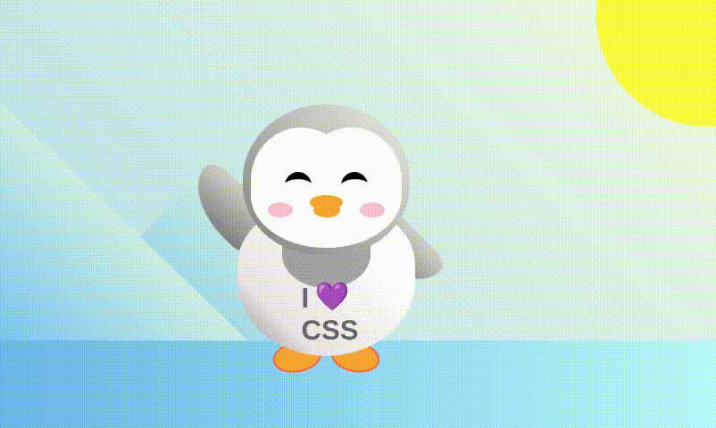

# Flappy Penguin 🐧



**Flappy Penguin** is a visually engaging web-based animation built entirely with **HTML** and **CSS**. The project showcases a cartoon penguin whose left hand waves continuously, set against a colorful scenic background. Beyond animation, this project demonstrates advanced layout, styling, and CSS techniques, making it a strong portfolio piece for front-end development.

---
For a live demo and smoother animation experience, visit: [Flappy Penguin Live](https://karianjahi.github.io/flappy-penguin/)

---


## Table of Contents
- [Features](#features)
- [Demo](#demo)
- [Project Structure](#project-structure)
- [Technologies Used](#technologies-used)
- [How to Run](#how-to-run)
- [Key Learnings](#key-learnings)
- [License](#license)

---

## Features

- **Penguin Animation**: Smooth, infinite waving animation on the penguin's left arm using CSS `@keyframes`.
- **Detailed Cartoon Design**: Fully constructed penguin using HTML `<div>` elements and CSS styling.
- **Responsive Layout**: Penguin is centered and scales appropriately across different screen sizes.
- **Scenic Background**: Includes mountains, sun, and ground layers for a more engaging visual presentation.
- **Interactive Scaling**: Click on the penguin to scale it up for a playful interactive effect.

---

## Demo


You can view the animation by opening `index.html` in your browser.

---

## Project Structure

flappy-penguin/
├── images/
│   └── animation-flappy-penguin.gif   # Demo GIF of the penguin animation
├── .gitignore                         # Git ignore file
├── index.html                          # Main HTML structure
├── README.md                           # This file
└── styles.css                          # CSS styles and animations

---

## Technologies Used

## Technologies Used

- HTML5: Semantic and nested `<div>` structure to build the penguin and environment.
- CSS3:
  - Absolute positioning for layout
  - `linear-gradient` for color blending
  - `border-radius` for smooth shapes
  - `@keyframes` for continuous animation
  - Transformations and scaling for interactivity
- Responsive Design Principles: Ensures the penguin scales nicely across different screen sizes.

---

## How to Run

1. Clone the repository:
   ```bash
   git clone https://github.com/your-username/flappy-penguin.git
   ```

2. Navigate to the project folder:
```bash
cd flappy-penguin
```
3. Open index.html in any modern browser:
```bash
open index.html
```
- Or simply double-click the `index.html` file
- No server setup is required — everything runs directly in the browser.

## Key Learnings & Skills Demonstrated
- **CSS Animations**: Implemented smooth waving motion with `@keyframes`.

- **Complex Layouts**: Built a multi-layered scene using `absolute` positioning and `z-index`.

- **Advanced Styling**: Mastered gradients, `border-radius`, and `pseudo-elements` to craft a detailed cartoon character.

- **Responsive Design & Interactivity**: Penguin scales and reacts to clicks, enhancing user engagement.

- **Portfolio-Ready**: Showcases industry-level front-end skills, combining creativity and technical knowledge.

## License
This project is open-source and available under the MIT License.

---

Flappy Penguin is a playful yet professional demonstration of front-end prowess — perfect for animation enthusiasts and aspiring web developers alike!


